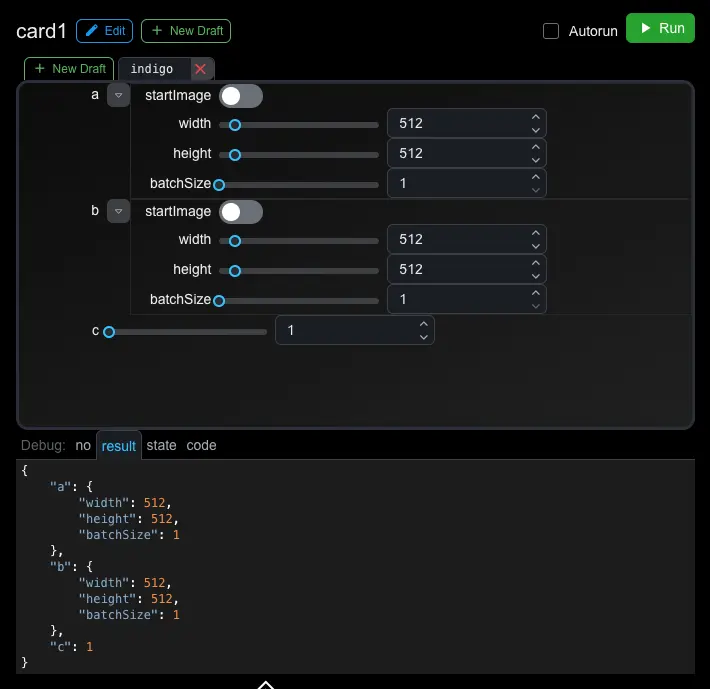

# Uodular decks example

This deck define a few cards that reuse the same high-level widgets via modular UI kits

---

### Step 1: define a modular UI kit

The simplest way to define a modular UI kit is to create a file that exports a function that takes a `frormBuilder` as single parameter, and returns a widget.

example:

```ts
// FILE: `_ui.ts`
import type { FormBuilder } from 'src/controls/FormBuilder'

// 📝 this is a self-contained UI kit you can use in any card you want.
export const subform_startImage = (form: FormBuilder) =>
    form.group({
        items: () => ({
            startImage: form.imageOpt({ group: 'latent' }),
            width: form.int({ default: 512, group: 'latent', step: 128, min: 128, max: 4096 }),
            height: form.int({ default: 512, group: 'latent', step: 128, min: 128, max: 4096 }),
            batchSize: form.int({ default: 1, group: 'latent', min: 1, max: 20 }),
        }),
    })
```

---

### Step 2: use your UI-kit

To use this UI kit in your card, you can simply import it and use it in the `ui` function of your card.

**Example**: in the `card1.ts` card, you can see that both fields `"a"` and `"b"` re-use the same helper

```ts
// FILE: `card1.ts`
import { subform_startImage } from './_ui'

card({
    name: 'card1',
    ui: (formBuilder) => {
        return {
            a: subform_startImage(formBuilder), // 👈 HERE
            b: subform_startImage(formBuilder), // 👈 HERE
            c: formBuilder.int({ default: 1 }),
        }
    },
    run: async (flow, p) => {
        flow.print(`startImage: ${p.a.startImage}`)
        flow.print(`startImage: ${p.b.startImage}`)
    },
})
```

---

### Step 3: Profit

The resulting card looks like this:


